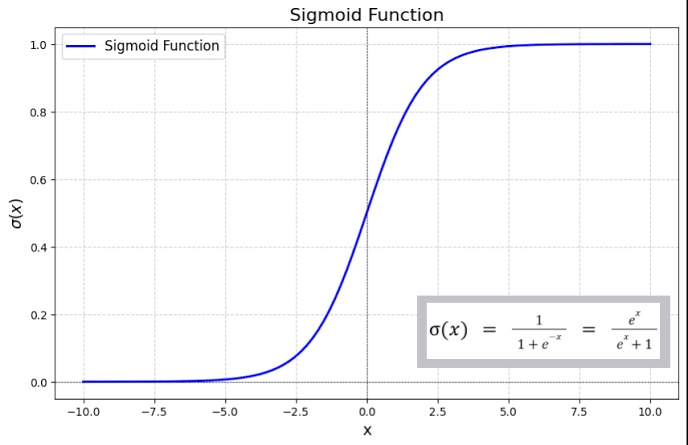

# Sigmoid & ReLU - Activation Functions

Before I get to explain what sigmoid and ReLU are and how they work, it's important that we understand where they are used.

---

# Where are Activation Functions Used?

Let's imagine we have a single neuron.

It first computes:

$$
z = w_1x_1 + w_2x_2 + b
$$

This is called the **weighted sum** or **logit**.

Suppose:

```text
Input   = [Height, Weight]

Weights = [2, -1]

Bias    = 3
```

Now imagine it got:

$$
z = 19
$$

or

$$
z = -7
$$

What does the **19** actually mean?

It means nothing. It's just a number.

The neuron needs a way to interpret this number. That's where **activation functions** come in.

They answer:

> **Given this score, how active should this neuron become?**

---

# Why are Activation Functions Important?

These activation functions introduce **non-linearity** because if, let's say, we have a **100-layer neural network** and every layer is just **ax + b**, a linear function, that's just a linear regression algorithm.

It can't learn curves, and it can't recognise faces or understand language.

Activation functions basically introduce non-linearity.

Each neuron first computes a weighted sum:

$$
z = Wx + b
$$

and the activation function transforms that value before passing it to the next layer.

---

# ReLU (Rectified Linear Unit)

In the case of **ReLU (Rectified Linear Unit)**, negative scores/outputs are set to **zero** while positive scores pass through, making the neuron effectively inactive or active.

This non-linear transformation prevents the entire network from collapsing into a single linear equation and allows it to learn complex patterns.

---

# What is Sigmoid?

The formula for sigmoid is:

$$
\sigma(x)=\frac{1}{1+e^{-x}}
$$

Let's forget we have the formula and break it down.

---

## We have

$$
e^{-x}
$$

where **e** is roughly **2.718**.

Now let's imagine a value for **x**.

---

## 1. Positive Value

$$
e^{-100}
$$

This becomes extremely tiny.

### Calculate

Using the exponent rule:

$$
e^{-n}=\frac{1}{e^n}
$$

So,

$$
\frac{1}{e^{100}}
=================

# \frac{1}{2.688\times10^{43}}

3.72\times10^{-44}
$$

which is a really small number, almost zero.

---

## 2. Negative Value

$$
e^{-(-100)} = e^{100}
$$

This becomes really big.

---

## So That's Why We Add One

### Positive x

$$
1+\text{tiny}\approx1
$$

### Negative x

$$
1+\text{huge}\approx\text{huge}
$$

---

## Now Take the Reciprocal

### Positive numbers

$$
\frac{1}{1}\approx1
$$

### Negative numbers

$$
\frac{1}{\text{huge}}\approx0
$$

Well, here we have something amazing.

Every number gets compressed into **0 to 1**, no matter how huge it is.

---

# Let's Calculate One

Suppose

$$
x=2
$$

Compute

$$
e^{-2}\approx0.135
$$

Now

$$
1+0.135=1.135
$$

Now

$$
\frac{1}{1.135}=0.881
$$

So

$$
\sigma(2)=0.881
$$

---

# Why is Sigmoid Used?

Mainly:

* producing probability-like outputs
* Logistic regression
* Binary classification

---

# But There's a Problem with Sigmoid

Looking at the graph, we can see that it gets flat.

That means the gradients become tiny, and that means gradient descent barely updates the weights.

Learning becomes extremely slow.

This is called the **Vanishing Gradient**.

One of the biggest reasons modern hidden layers rarely use sigmoid.



---

# ReLU

The formula for ReLU is

$$
\text{ReLU}(x)=\max(0,x)
$$

This is much simpler than sigmoid.

It simply compares the input with **0**.

If the input is negative, it returns **0**.

If the input is positive, it returns the input itself.

For example,

$$
\text{ReLU}(-5)=0
$$

$$
\text{ReLU}(3)=3
$$

$$
\text{ReLU}(12)=12
$$

You can think of ReLU as an **on/off switch**.

Negative values turn the neuron off.

Positive values allow the neuron to pass its value to the next layer.

---

# Why is ReLU Used?

Unlike sigmoid, ReLU does **not** squash large positive values into a number between 0 and 1.

For example,

$$
\text{ReLU}(100)=100
$$

whereas

$$
\sigma(100)\approx1
$$

This allows gradients to stay much larger during backpropagation, making neural networks train much faster.

Because of this, ReLU has become the default activation function for most hidden layers in modern neural networks.

---

# Problem with ReLU

ReLU also has a downside.

If a neuron always receives a negative input, it will always output

$$
0
$$

Since the gradient is also

$$
0
$$

the weights stop updating.

The neuron effectively dies and never becomes active again.

This is called the **Dying ReLU** problem.

To solve this, variants such as **Leaky ReLU** allow a very small negative slope instead of outputting exactly zero.

---

# Summary

| Activation Function | Output Range | Common Uses                                                      | Main Problem       |
| ------------------- | ------------ | ---------------------------------------------------------------- | ------------------ |
| **Sigmoid**         | (0, 1)       | Binary classification, logistic regression, output probabilities | Vanishing Gradient |
| **ReLU**            | [0, ∞)       | Hidden layers                                                    | Dying ReLU         |


