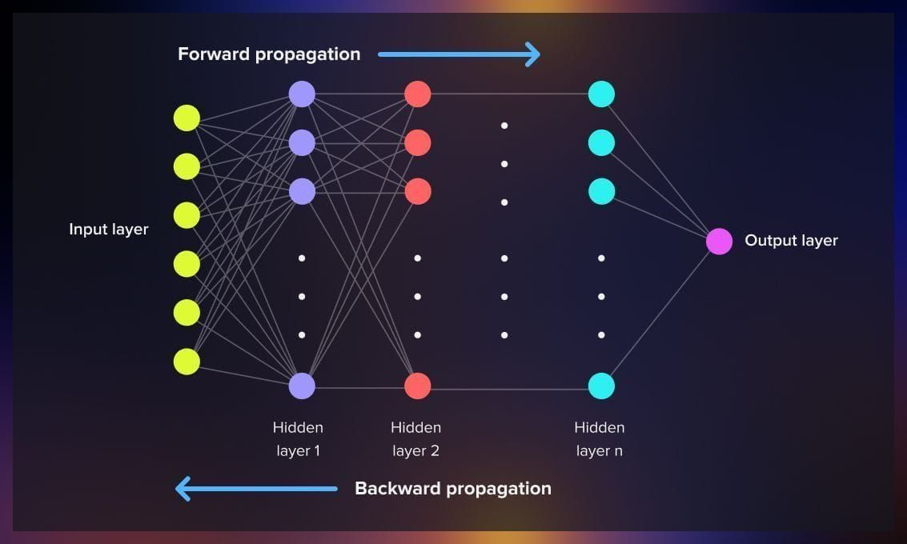
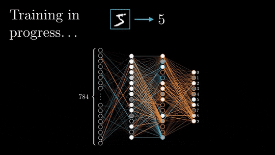

# Back propogation (Backward propogation [to spread, grow, or transmit] of errors)

### Forward pass

During the forward pass, the input data is propagated through the network layer by layer, starting from the input layer and moving towards the output layer. Each neuron in the network receives inputs, calculates a weighted sum of the inputs, applies an activation function, and passes the output to the next layer. This process continues until the final output is obtained. The forward pass calculates the output of the network based on the current weights.

---

## Back Propogation

Backpropogtion is the core algorithm used to train an neural network. It calculates the gradient of the loss function for each weight by moving backwards from the output layer to the input layer using the chain rule of calculus so an optimizer like gradient descent adjust the parameters the reduce the loss function

- The simplest mathematical explanation for this is to calculate the derivatives of every thing in the input layer backwards and mulitply them to calculate the gradient [Measures how fast and in what direction a quantity changes helps us to decide in what position to move either uphill or down hill]

[https://www.khanacademy.org/math/ap-calculus-ab/ab-differentiation-2-new/ab-3-1a/a/chain-rule-review](Chain Rule Explanation)

# Backpropagation & the Chain Rule (Simplified)

Imagine a simple machine learning model as an assembly line:
`Input (x) → times Weight (w) → makes (z) → squared makes Prediction (ŷ) → compared to truth makes Loss (L)`

**The Goal:** We want to know how tweaking the weight ($w$) changes our error (Loss, $L$). In math, this is called the derivative: $\frac{\partial L}{\partial w}$.

---

## 1. The Forward Pass (Making a Prediction)
The signal moves forward:
$$w \rightarrow z \rightarrow \hat{y} \rightarrow L$$

If we change $w$, it ripples forward: $z$ changes, which changes $\hat{y}$, which changes the final Loss ($L$).

---

## 2. The Chain Rule (Working Backwards)
Since the steps are linked like a chain, we can find out how $w$ affects $L$ by working backward step-by-step and multiplying the effects together:

$$Total Effect = (Effect of \ \hat{y} \ on \ L) \times (Effect of \ z \ on \ \hat{y}) \times (Effect of \ w \ on \ z)$$

Let's find those three pieces using basic calculus:

**Step 1: The Loss Error**
*   Formula: $L = (\hat{y} - y)^2$
*   Derivative (Effect): $2(\hat{y} - y)$

**Step 2: The Prediction Step**
*   Formula: $\hat{y} = z^2$
*   Derivative (Effect): $2z$

**Step 3: The Weight Step**
*   Formula: $z = w \cdot x$
*   Derivative (Effect): $x$

---

## 3. Multiply it all together!
We just multiply the three pieces we found:

$$\frac{\partial L}{\partial w} = 2(\hat{y} - y) \cdot 2z \cdot x$$

Simplified, our final gradient is:
**$$4(\hat{y} - y)zx$$**

This tells us exactly how to adjust $w$ to reduce our error.

---

## 4. Gradient Descent (Learning)
Now that we know *how* to change $w$, we actually change it. We subtract a small portion of the gradient from our current weight to improve the model.

$$w \leftarrow w - (learning\ rate \times gradient)$$

---

## Summary
*   **Forward Pass:** Guess the answer.
*   **Loss:** See how wrong the guess is.
*   **Backpropagation (Chain Rule):** Work backward to figure out which part is to blame for the error.
*   **Gradient Descent:** Adjust the weights to make a better guess next time.
