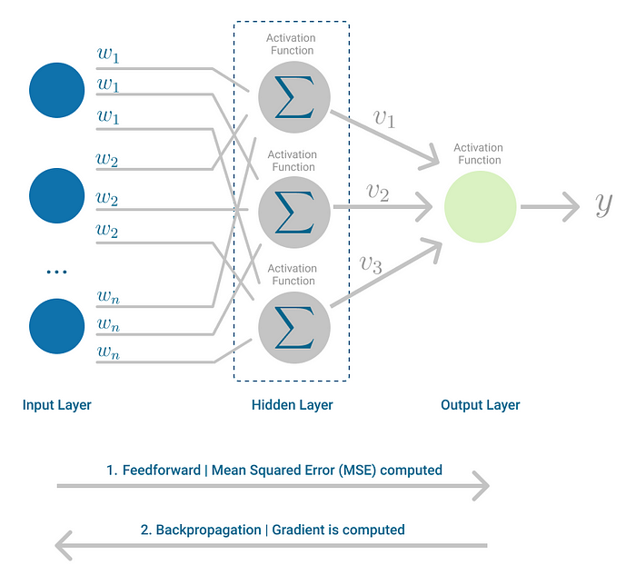

# MLP [Multi Layer perceptron (A neural network)]

We've built a single perceptron and learnt how to perform backpropogration in this module we're going to learn what is an MLP and how it work

A multi layer perceptron is nothing but multiple perceptron connected together to process the inputs and throw an output

It consists of an input layer one or more hidden layers and an output layer, MLP's use non linear activation functons to learn complex patterns and solve problems that are not linearly seperatble unlike linear rgression or related algorithms

## How does it learn ? 

1. Forward Propogation: Pass the data through the hidden layers to the output layer to make an prediction
2. Loss calculation: Measuring the error between the prediction and the true "target" value
3. Backpropogation: The error moves backward through the netwrok using the chain rule calculating the gradient for each weight and bias in each layer
4. Weight optimization: The process of updating the weights and the biases across all the layers in the network