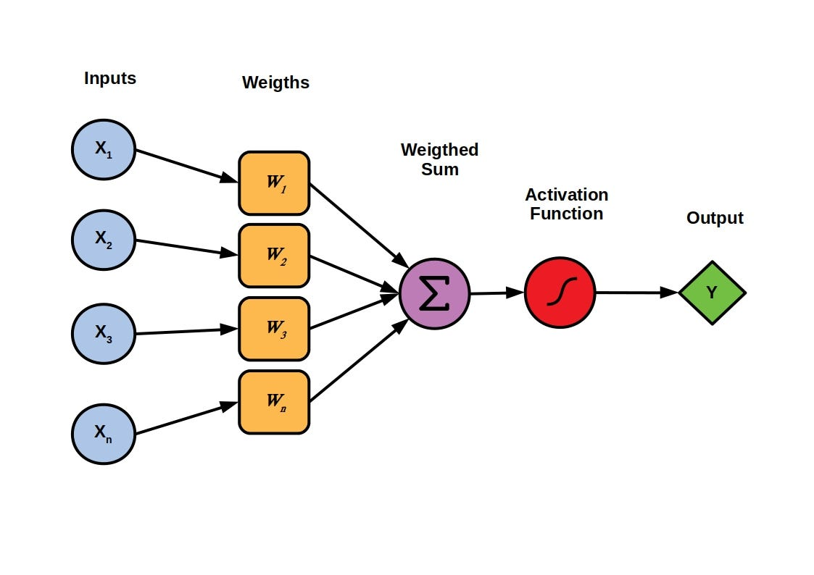
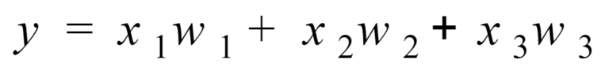
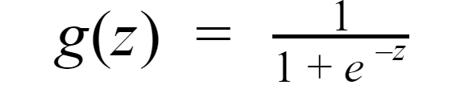
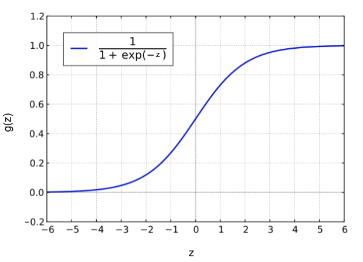

# A Single Neuron (A perceptron)

A perceptron can be defined as the simplest or the basic building block of a neural network. It acts as a binary classifier and mimics the biological/human neuron,

In instuition it's flow is pretty simple

- Take inputs multiplys each by a weight add a bias and then use a activation function in the end and outputs a 0 or 1 

## "The Function"

The function below is called weighted sum because it's the sum of the weights and the inputs. This alone can't output a prediction of 1 and 0 that's why we use a activation function 

## Logistic Functions

Logistical functions have the formula,

Where the graph looks like:

Notice that g(z) lies between the points 0 and 1 and that this graph is not linear. This will allow us to output numbers that are between 0 and 1 which is exactly what we need to build our perceptron.