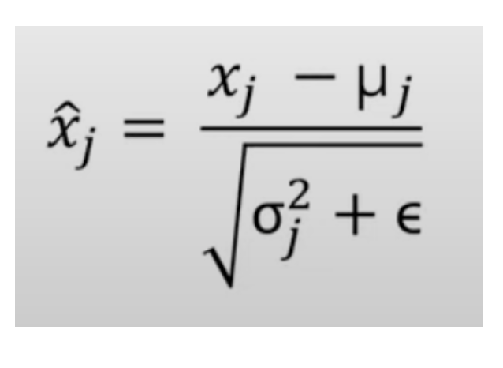

# Layer Normalization

In the case of many stacked layers in the MLP, a problem arises - the values flowing through the neural network can either exponentially increase (divergence) or decrease to zero. To prevent this from happening, Layer Normalization re-centers and rescales each layer independently.

This normalization method is really important because each transformer block consists of two Layer Normalizations before attention mechanisms are applied.

## Formula:

### Description:

Layer Normalization is a process of normalizing each example *independently* over its features.

Steps to perform:

1. **Find the Mean** over all features:

$$\mu = \frac{1}{n} \sum x_i$$

2. **Find the Variance**:

$$\sigma^2 = \frac{1}{n} \sum (x_i - \mu)^2$$

3. **Normalize, scale, and shift** the data:

$$\hat{x}_i = \frac{x_i - \mu}{\sqrt{\sigma^2 + \epsilon}} \cdot \gamma_i + \beta_i$$

* $\gamma$ and $\beta$ - learnable parameters for scaling and shifting of normalized features.
* $\epsilon = 10^{-5}$ is just a small constant to prevent division by zero.