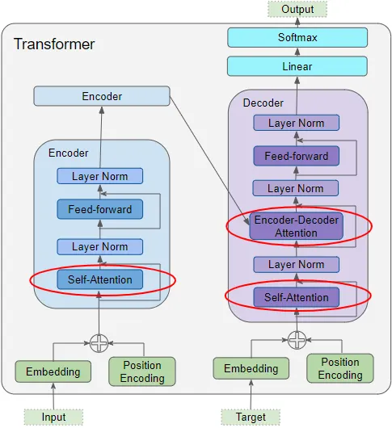
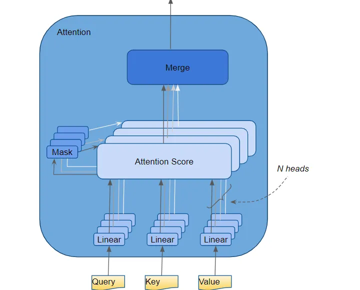
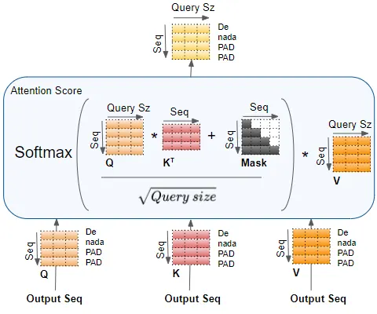

# Multi Headed Self Attention

## How Attention is used in the Transformer

As we discussed Self Attention, Attention is used in the Transformer in three places:

- Self-attention in the Encoder — the input sequence pays attention to itself
- Self-attention in the Decoder — the target sequence pays attention to itself
- Encoder-Decoder-attention in the Decoder — the target sequence pays attention to the input sequence

  

## Multiple Attention Head:

In the transofmrer the attention module repeats it's computation multiple times in parralel. Each of these are called an attention head, and attention ehad is an single self attention layer in the multi layer self attention block calculating the parameters and later merging the output of the all the other self attention heads where each has worked on a different aspect of the sentence producing a final attention score

This gives transfrormers greater power to encode multiple relationships for each wrod

  

## Merge each Head’s Attention Scores together

We now have separate Attention Scores for each head, which need to be combined together into a single score. This Merge operation is essentially the reverse of the Split operation.

It is done by simply reshaping the result matrix to eliminate the Head dimension. The steps are:

1. Reshape the Attention Score matrix by swapping the Head and Sequence dimensions. In other words, the matrix shape goes from (Batch, Head, Sequence, Query size) to (Batch, Sequence, Head, Query size).
2. Collapse the Head dimension by reshaping to (Batch, Sequence, Head * Query size). This effectively concatenates the Attention Score vectors for each head into a single merged Attention Score.

  

