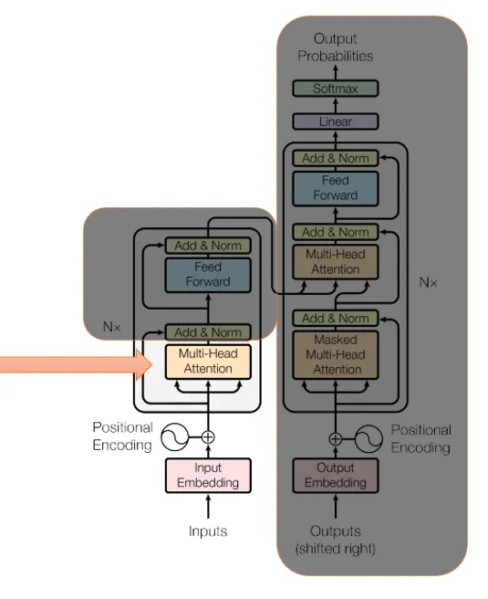
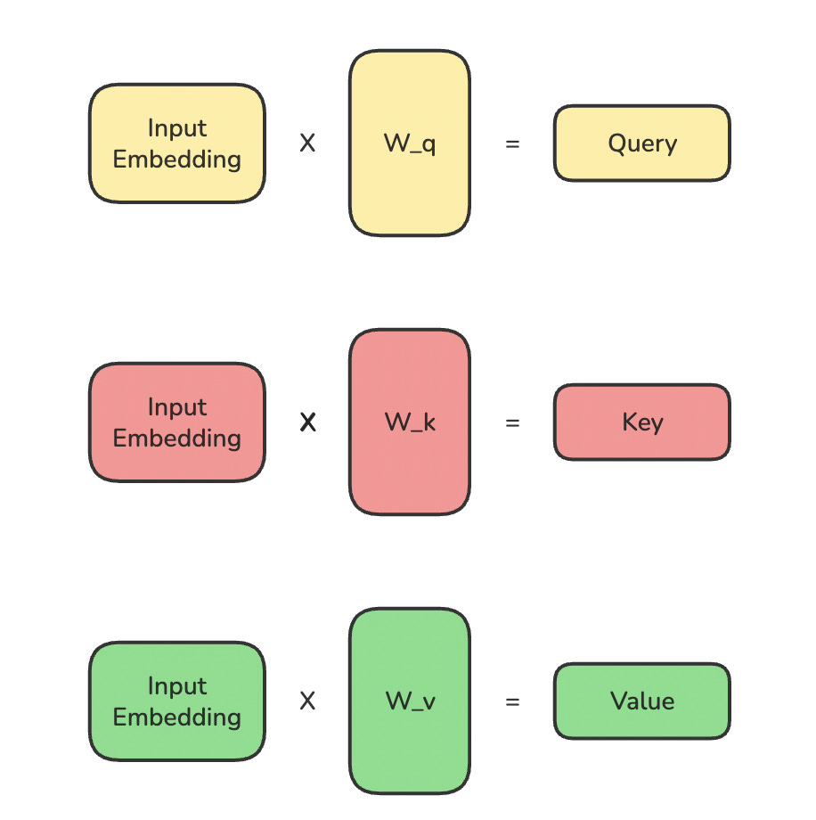
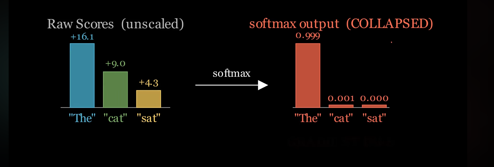
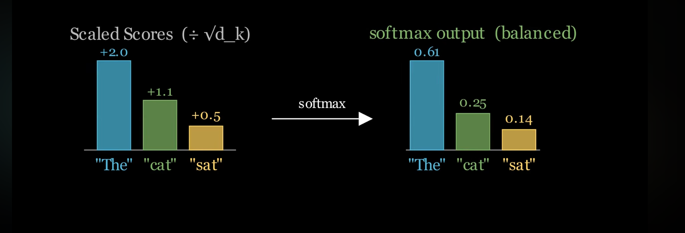
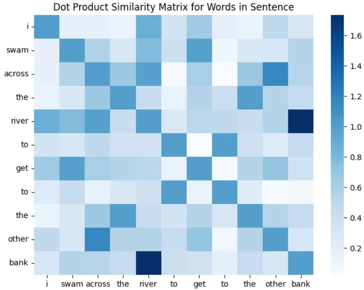
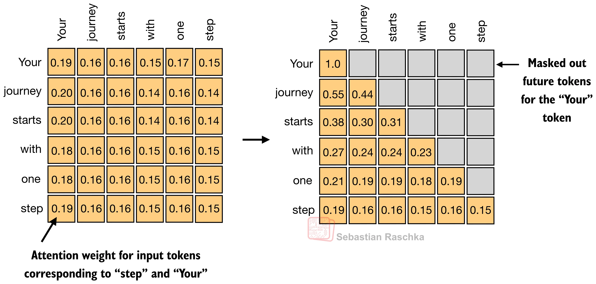

# Self Attention

## Core idea

Self attention is an AI mechanism which allows words/tokens in an sentence to look at each other and understand the relationship between each other and figure out the words to focus the most on for context and meaning

Traditional AI models worked sequentially looked at one word at a time losing the context earlier, e.g RNN, LSTM's. Unlike the following self attention looks at the words parrallely

The attention in self attention is the part is what assigns the words with scores so the AI can understand the context and relationship better

## Example

An example:

Let's say we have this sentence:
> The animal didn't cross the street because it was too tired,
> Now here our AI wouldn't know what "it" is referring to that's when self attention comes in, it allows the word it to look at all the other words and figure out the relationship between them like "it" correlates the best with animal and street returning a higher score with these two words helping the AI understand the relation

The self-attention mechanism is designed to capture the contextual information by allowing a model to weigh the influence of neighboring words on a given word. This process enhances the meaning of the word by considering its surroundings.

## How self attention works:

Tokenization: Breaking a sentence into smaller parts called tokens. There are different ways to do this, but for simplicity, we will separate each word by spaces, as shown in image below.

Word Embedding: Computers do not understand words- they only work with numbers. To convert tokens in to a form that computers can process, we use word embeddings (In the original paper, the Transformer model uses learned embeddigns which learns embeddings from scratch throughout the traing process, rather than relying on pre-trained embeddings like Word2Vec or GloVe.)>

Word vectors are not just random numbers. They carry semantic and contextual meaning, which means words with similar meanings are placed closer together in the numerical space. For example, in an embedding space, words like “king” and “queen” or “river” and “stream” will be positioned near each other because they have related meanings.

How self attention works:

This mechanism transforms input words into context aware representations using three main vectors:

1. Query (Q): Represents what a specific word is currently looking for or focusing on
2. Key (K): Represents how relavent a wrord is when compared against the query
3. Value (V): Contains the actual content or meaning of the word, which is scaled and summmed

  

### 1. Inputs to vectors

Our natural language words are converted into Vectors which helps you understand how each word realtes to each other on a dimentional graph for example

The -> [-0.90, 0.70, 0.10, -0.10] -> x1
Cat -> [0.20, 0.30, 0.10, -0.10] Lives near dog in a space because a animal -> x2
Sat -> [0.60, 0.10, -0.70, -0.20] -> x3

These together represnt a single varible X which is later multiplied by Q, K and V (Q, K and V are just weights in a linear layer so it's a linear layer without bais)

$$Q = XW_Q, \quad K = XW_K, \quad V = XW_V$$

  

### 2. Formula

Later we follow a simple formula which is

$$\text{Attention}(Q, K, V) = \text{softmax}\left(\frac{QK^T}{\sqrt{d_k}}\right) V = Z$$

  

### 3. Scores

Let's go through it:
Here we're firstly multiplying the Q and K together to get something called attention scores these scores help us define the foundation to understand the relation between words

$$S = QK^T$$

  

The grid serves as a raw attention map the positive relation between cat and sat there means that the mechanism has captured the relationship between the object and the target but these are just raw attention scores. The catch here is that the magnitude can explore in dimension this can lead the softmax functions output to be completely broken and biased

$$\text{softmax}(S_{\text{unscaled}}) \rightarrow \text{collapsed: e.g. } [0.999, 0.001, 0.000]$$

  

### 4. Scale

That's why we divide the Q * K transpose with squareroot of dimension of key vectors

$$S_{\text{scaled}} = \frac{QK^T}{\sqrt{d_k}}$$

After Scaling

$$\text{softmax}(S_{\text{scaled}}) \rightarrow \text{balanced: e.g. } [0.61, 0.25, 0.14]$$

  

### 5. Softmax

After this we basically apply the softmax function in order to convert these raw attention scores into use ful probability distributions
This is why it's called scaled dot product attention score

$$A = \text{softmax}\left(\frac{QK^T}{\sqrt{d_k}}\right)$$

Q.KT = Raw Alignment/Attention scores
/root(dk) -> Varience Stabalized
Softmax -> Converts scores in to probability

### 6. Weighted sum [unfinished]

$$Z = A V$$

Noww the final step is to perform weighed sum of values
Here comes the V, V represents the actual content or information associaated with each other

creates the final contextualized word representation.

Why It MattersBlending Context: Instead of just copying a single word, the token's final representation becomes a smooth blend of itself and other relevant words in the sentence.

Dynamic Routing: The weights change dynamically depending on the surrounding words, allowing the model to understand ambiguous words based on their context (like whether "bank" means a riverbank or money)

Now, why to use the dot product?

    The dot product measures similarity between two vectors.
    A higher dot product value means two words are more related in the given sentence.

Let’s take our sentence of interest :

“I swam across the river to get to the other bank.”

    The dot product between “bank” and “swam” or “bank” and “river” will be high, indicating a strong relationship.
    The dot product between “bank” and “other” might be lower since “other” doesn’t contribute much meaning in this context.
    If “bank” appeared in another sentence like “I deposited money at the bank,” its dot product with “money” or “deposited” would be higher instead.

  

### 7. Causal Masking

When we're talking bout causal masking, it's an mechanism in decoder only models like GPT LLama etc which prevents the tokens from actually cheating by hiding the future tokens in the future positions in a sequence

Causal masking helps the model behave autoregressively (The ability of an model to predict the text token using the past information). 

Basically in the training phase of an model, it ensures that the model is only able to look at the past and the present token.

Example:

"The cat sits on a mat"

Here the word "mat" is actually masked because we want the model to predict that word and not rely on it during training 

How it works:

1. A lower traigular matrix: the mask matrix is applied to the raw attention scores before the softmax function 
2. Negative infinity: Future tokens are set to infiinity while current and apst are 0 making it so it doesn't bother about the future words

  

Next up we have multi headed model in
[Todo] Attention & Transformers/[Todo] Multi Headed Self Attention

Resorouces used:

- https://medium.com/@manindersingh120996/the-detailed-explanation-of-self-attention-in-simple-words-dec917f83ef3
- https://www.youtube.com/watch?v=vkhPtpUiLd8
- https://youtu.be/LPZh9BOjkQs?si=orU_xQju9YsnNgKD
- https://arxiv.org/abs/1706.03762