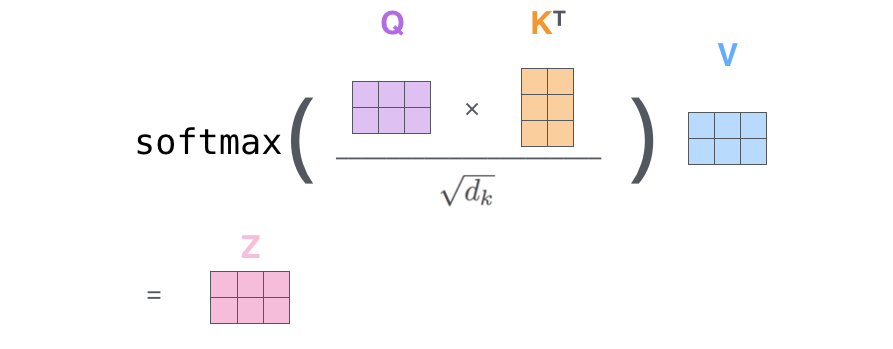
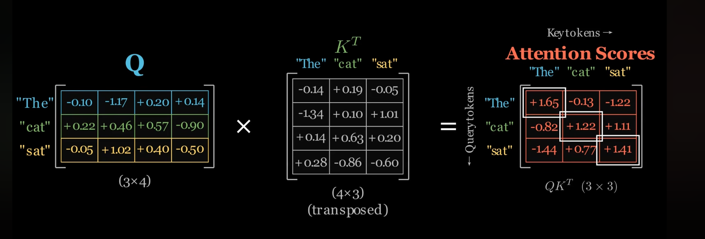

# Self Attention

Self attention is an AI mechanism which allows words/tokens in an sentence to look at each other and understand the relationship between each other and figure out the words to focus the most on for context and meaning
Traditional AI models worked sequentially looked at one word at a time losing the context earlier, e.g RNN, LSTM's. Unlike the following self attention looks at the words parrallely
The attention in self attention is the part is what assigns the words with scores so the AI can understand the context and relationship better

An example:

Let's say we have this sentence: 
  The animal didn't cross the street because it was too tired,
  Now here our AI wouldn't know what "it" is referring to that's when self attention comes in, it allows the word it to look at all the other words and figure out the relationship between them like "it" correlates the best with animal and street returning a higher score with these two words helping the AI understand the relation 

How self attention works:

This mechanism transforms input words into context aware representations using three main vectors:

1. Query (Q): Represents what a specific word is currently looking for or focusing on
2. Key (K): Represents how relavent a wrord is when compared against the query 
3. Value (V): Contains the actual content or meaning of the word, which is scaled and summmed 

Our natural language words are converted into Vectors which helps you understand how each word realtes to each other on a dimentional graph for example

The -> [-0.90, 0.70, 0.10, -0.10] -> x1 
Cat -> [0.20, 0.30, 0.10, -0.10] Lives near dog in a space because a animal -> x2 
Sat -> [0.60, 0.10, -0.70, -0.20] -> x3

These together represnt a single varible X which is later multiplied by Q, K and V (Q, K and V are just weights in a linear layer so it's a linear layer without bais)

Later we follow a simple formula which is

Let's go through it:
Here we're firstly multiplying the Q and K together to get something called attention scores these scores help us define the foundation to understand the relation between words

The grid serves as a raw attention map the positive relation between cat and sat there means that the mechanism has captured the relationship between the object and the target but these are just raw attention scores. The catch here is that the magnitude can explore in dimension this can lead the softmax functions output to be completely broken and biased 

That's why we divide the Q * K transpose with squareroot of dimension of key vectors 

After Scaling

After this we basically apply the softmax function in order to convert these raw attention scores into use ful probability distributions
This is why it's called scaled dot product attention score

Q.KT = Raw Alignment/Attention scores
/root(dk) -> Varience Stabalized
Softmax -> Converts scores in to probability

Noww the final step is to perform weighed sum of values 
Here comes the V, V represents the actual content or information associaated with each other it's more like 